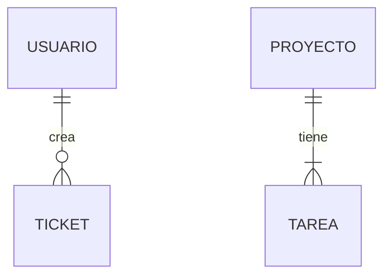

# 🗄️ Diccionario de Datos (Norma ISO/IEC 11179)
## Entidad: [Nombre de la Tabla] (Modelo Entidad-Relación - Notación de Chen/Crow's Foot)
*Descripción: Almacena la información de...*

| Campo | Tipo | Nulo | Descripción | Ejemplo |
| :--- | :--- | :---: | :--- | :--- |
| **id** | UUID | No | Clave primaria autogenerada | `550e8400...` |

## Relaciones (Diagrama ER Notación UML/Relacional)
